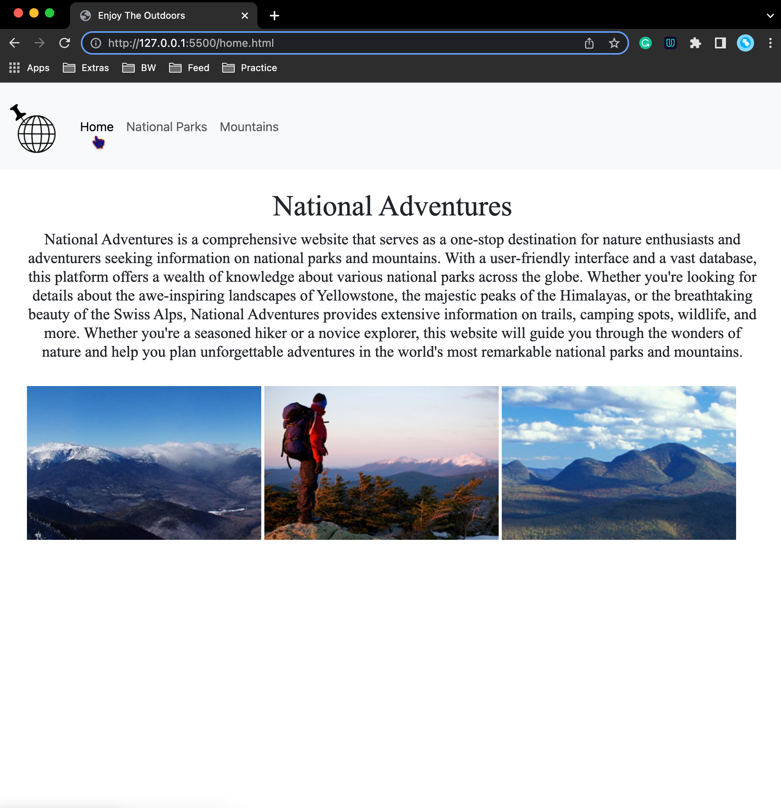
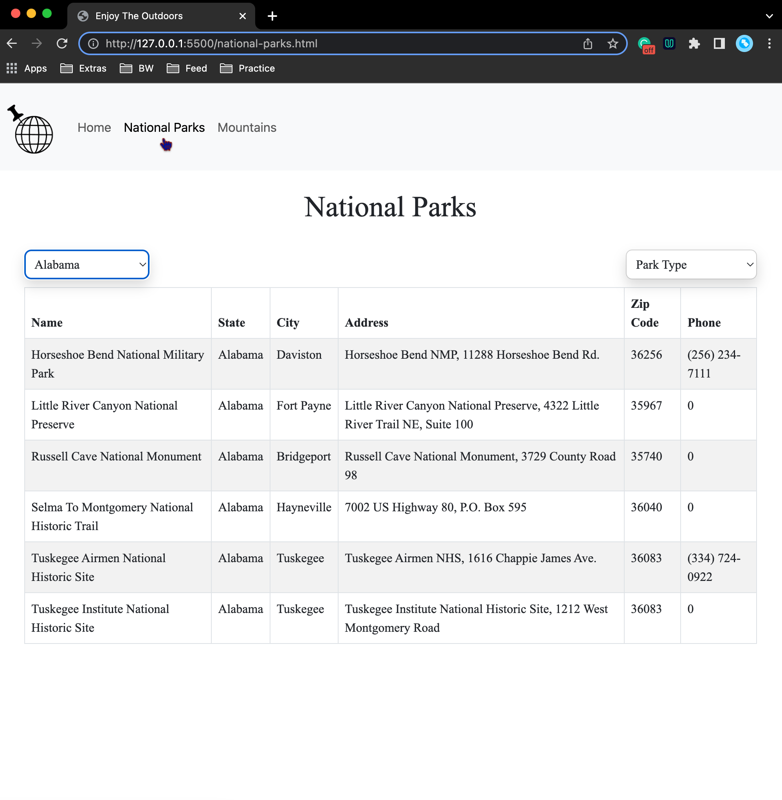
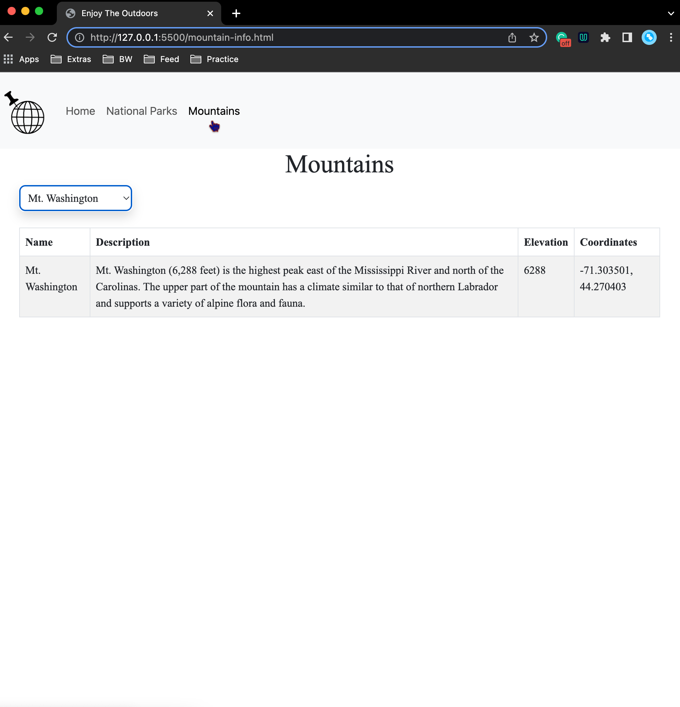

# Capstone 2 Enjoy the Outdoors

This website provides information about the national parks and mountains across America for Users to enjoy.

## Home Page

- The Home Page display tells users what they are expected to find on the website and includes images of mountains

## Parks

- The National Parks Page is dedicated for users to search for any park. There are two search options one by the type of park and the other by location. Once they select from one dropdown a table will display with information about their selected park.

## Mountains

- The Mountains Page is for users to search for any mountain of thri choosing by name and once selected that mountains information will display in a tabe below.

